<div align="center">



`[ SYSTEM ONLINE ]` · `[ PDX/PNW · UTC-8 ]` · `[ ENGINEERING & PRODUCT ]`

<a href="https://www.norvinfaltir.com" traget="_blank">🦜🥭🌴</a>

</div>

---

```console
norvin@nodelab:~$ whoami 
```

```
> Software Engineer. I build financial data tooling end to end —
> ingestion, domain logic, rendering, distribution.
>
> Currently: Nodelab, a Django platform that turns SEC EDGAR / FRED /
> market data into charts people actually read. Econ degree, fullstack
> hands. Python as orchestrator, Go for the hot paths.
>
> Shipping in public @Nodelookup.
```

---

```console
norvin@nodelab:~$ cat /etc/languages
```

<div align="center">


</div>

---

```console
norvin@nodelab:~$ ls -la ~/projects
```

```
drwxr-xr-x  nodelab/          financial data viz platform
drwxr-xr-x  vault/            client-side encryption, go + wasm
drwxr-xr-x  manim-shorts/     animated market explainers
drwxr-xr-x  xanalytics/       x/twitter post performance pipeline
drwxr-xr-x  clipper/          yt-dlp + ffmpeg clip factory
drwxr-xr-x  secret-santa/     christmas family app, next.js
drwxr-xr-x  homebase/         property + contractor management
```

**`>` [nodelab](#)** — Django platform for financial charts. Hexagonal
architecture, framework-free domain core. Point & figure with trendline and
S/R detection, revenue breakdowns off SEC EDGAR, treemaps, FRED macro series,
9:16 mobile renders. Golang extraction points wired at the hot paths.

**`>` [vault](#)** — Browser-native encryption in Golang/WASM. AES-256-GCM +
Argon2id, streaming chunked pipeline across Web Workers, custom `VAULT2`
binary format, tar+gzip directory mode. Post-quantum hybrid scoped.

**`>` [manim-shorts](#)** — Animated stock-return explainers for YouTube
Shorts. Custom counter class (no LaTeX dep), ffmpeg audio merge, branded
outro cards.

**`>` [xanalytics](#)** — CSV ingestion + snapshot models for X post
performance. Tracks what actually travels vs. what dies quietly.

**`>` [clipper](#)** — yt-dlp + FFmpeg pipeline that cuts and brands video
clips without touching a timeline.

**`>` [secret-santa](#)** — Next.js 16 / Drizzle / Postgres. Concurrency-safe
single-participant draws, paper gift-tag theme, envelope animation, christmas family games

**`>` [homebase](#)** — Django property manager. Houses, services, amenities,
contractors. Google Places with OSM fallback, generated reports and brochures.

---

<div align="center">

```
 Always learning. Always building 🍍💯      
```

[](https://x.com/Nodelookup)
[](#)

`norvin@nodelab:~$ ` 

</div>